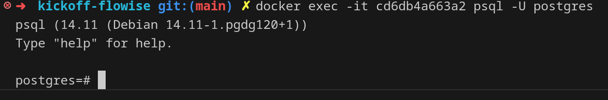

<h1 align="center">
  <br/>
  AI Agent Studies
</h1>

<p align="center">
  

  
  
  <a href="https://github.com/LucasPereiraMiranda/ai-agent-studies/commits/master">
    
  </a>

  <a href="https://github.com/LucasPereiraMiranda/ai-agent-studies/issues">
    
  </a>
</p>

<br>

# Introduction

Project to study AI agent ecossystem using flowise, langfuse, typeboot, n8n, pgvector & portainer

## How to run

## Create volumes

We can create our volumes:

```bash
docker volume create flowise_data
docker volume create postgres_data
docker volume create pgadmin_data
docker volume create redis_data
docker volume create portainer_data
docker volume create n8n_data
```

## Create network

We can create our network:

```bash
docker network create network
```

## In other terminal, create databases

- List containers:

```bash
docker ps
```

We can collect postgres container hash

- Enter in container:

```bash
docker exec -it {hash postgres} psql -U postgres
```

- Create databases:
```sql
CREATE DATABASE flowise;
CREATE DATABASE langfuse;
CREATE DATABASE n8n;
```


## Execution preview

**Flowise** local: [http://localhost:3000/](http://localhost:3000/)
  

**n8n** local: [http://localhost:5678/](http://localhost:5678/)
  


**pg admin** local: [http://localhost:3007/](http://localhost:3007/)
  


**Postgres** local: [http://localhost:3007/](http://localhost:3007/)
  
